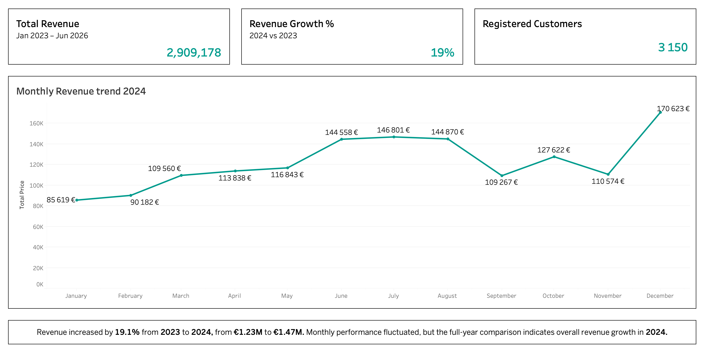

# Week 5 — Visualisation Design

## Role A: CEO Dashboard — Is UrbanStyle Growing?

For Week 5, I worked on **Role A: CEO Dashboard**.

The stakeholder question was:

**Is UrbanStyle growing?**

I built the dashboard in **Tableau Public**, using UrbanStyle sales and customer data exported from Supabase.

The dashboard focuses on a small set of high-level metrics and a monthly revenue trend so that the CEO can quickly understand the overall direction of the business.

## Dashboard

The dashboard contains three headline KPIs:

- **Total Revenue:** €2.91M
- **Revenue Growth:** +19.1% in 2024 vs 2023
- **Registered Customers:** 3,150

The main visualisation shows **monthly revenue during 2024**.

## Key finding

UrbanStyle's revenue increased by **19.1% from 2023 to 2024**, growing from approximately **€1.23M to €1.47M**.

Monthly performance was not consistently increasing throughout 2024. Revenue fluctuated during the year, with particularly strong performance in June–August and the highest monthly revenue in December at approximately **€171K**.

The full-year comparison therefore provides stronger evidence of overall growth than the individual month-to-month movements.

### Business interpretation

**UrbanStyle showed positive year-over-year growth in 2024. Revenue increased substantially compared with 2023, although growth was uneven across individual months.**

The next analytical question would be to investigate what drove the 19.1% increase — for example, changes in customer numbers, purchase frequency, average order value, or a combination of these factors.

## Metric decisions

### Revenue growth

I compared **2024 with 2023** because these are directly comparable complete years in the dataset.

Revenue growth was calculated as:

`(2024 revenue - 2023 revenue) / 2023 revenue`

This resulted in **19.1% year-over-year growth**.

### Registered customers

The customer KPI shows **3,150 registered customers** from the customer dataset.

I labelled the metric explicitly as **Registered Customers** to distinguish it from customers who actually made a purchase.

### Total revenue

Total revenue represents sales across the full available sales period:

**Jan 2023 – Jun 2026**

The KPI therefore provides overall dataset context, while the main revenue chart focuses specifically on 2024 to examine the year used in the growth comparison.

## Design decisions

I used a **line chart** for monthly revenue because the primary analytical question concerns how revenue changes over time.

I used KPI cards for the headline metrics so that the main business results can be understood before examining the detailed monthly trend.

The monthly chart is intentionally larger than the KPI cards because it provides the main analytical evidence behind the dashboard.

I also included the business interpretation directly below the visualisation so that the dashboard communicates both the data and its business meaning:

> Revenue increased by 19.1% from 2023 to 2024, from €1.23M to €1.47M. Monthly performance fluctuated, but the full-year comparison indicates overall revenue growth in 2024.

The visual design uses a limited colour palette, consistent spacing and borders to separate KPI cards while keeping the focus on the data.

## Data validation

Before building the dashboard, I validated the main source data:

- **Sales rows / orders:** 10,118
- **Total revenue:** €2,909,177.98
- **Registered customers:** 3,150

This validation was completed before creating the Tableau visualisations to make sure the dashboard was based on the expected source-of-truth figures.

## Tools

- **Tableau Public** — dashboard and visualisation
- **PostgreSQL / Supabase** — source database
- **CSV** — data transfer from Supabase to Tableau

## Files

- `week5-roleA.twbx` — Tableau workbook
- `week5-roleA.png` — dashboard screenshot

## Team contribution

My contribution to the group exercise was the **CEO / growth view**.

The main finding shared with the team was:

**UrbanStyle's revenue grew by 19.1% year over year, from €1.23M in 2023 to €1.47M in 2024, although monthly performance remained uneven.**

This finding can be combined with the Marketing and Operations analyses to build the team's final investor view.

## AI use

I used AI as a learning assistant while working with Tableau because Tableau was not covered in the course materials. AI helped me understand how to implement calculations and visualisation features in Tableau and troubleshoot the tool.

I made the metric definitions, visualisation choices, dashboard layout and business interpretation based on the assignment requirements and the results in the data.