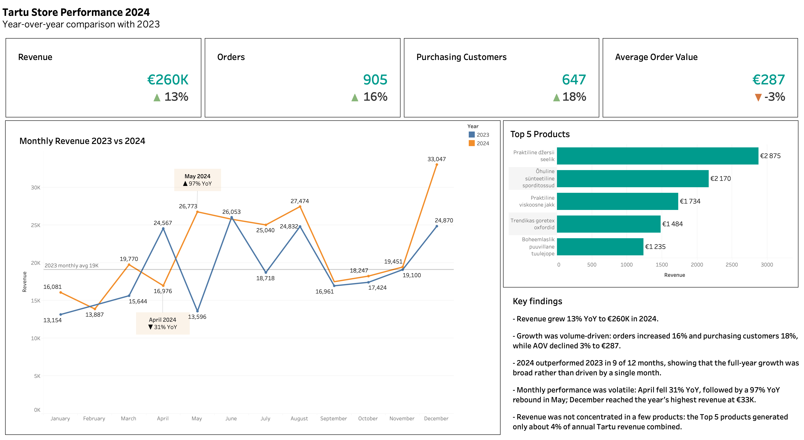

# Week 6 — Tartu Store Performance Dashboard

## Overview

This week focused on turning a working dashboard into a data story for a specific business audience.

My assigned location was the **Tartu store**. The task scenario suggested that Tartu was in decline, but after validating the actual data I found the opposite: **2024 revenue increased compared with 2023**. I therefore built the dashboard around the observed data rather than the scenario assumption.

## Business question

**How did the Tartu store perform in 2024 compared with 2023, and what drove the change?**

## Dashboard

The dashboard compares Tartu's 2024 performance with 2023 using:

- Revenue
- Order count
- Purchasing customers
- Average Order Value (AOV)
- Monthly revenue trend
- Top 5 products by revenue

It also includes a 2023 monthly-average reference line and annotations highlighting unusually large year-over-year changes.

### Key results

- 2024 revenue reached **€260K**, up **13% YoY**.
- Orders increased by **16%**.
- Purchasing customers increased by **18%**.
- AOV decreased by **3%** to **€287**.
- 2024 revenue was higher than 2023 in **9 of 12 months**.
- Monthly performance remained volatile: April was **31% below** the previous year, followed by a **97% YoY increase** in May.

### Main interpretation

Tartu's growth was primarily **volume-driven**. More customers made purchases and more orders were placed, while average spend per order declined slightly. The store therefore grew through customer and transaction volume rather than through higher order values.

## Tableau Public

**Live dashboard:** [Add Tableau Public link here](YOUR_TABLEAU_PUBLIC_URL)

## Files

- `individual/week6_tartu_dashboard_screenshot.png` — final dashboard screenshot
- `individual/week6_tartu_narrative.md` — 3–4 sentence data story
- `individual/week6_executive_summary.md` — executive summary / key findings
- `team/week6_team_combined_view.md` — team synthesis placeholder

## Tools

- Tableau
- Supabase / CSV source data

## AI use

I used ChatGPT as a learning and review assistant while working in Tableau: to clarify Tableau steps, check metric logic and calculations, and review whether the dashboard story was supported by the data. I made the analytical and visualisation decisions myself and adjusted the narrative when the actual Tartu data contradicted the scenario assumption.
